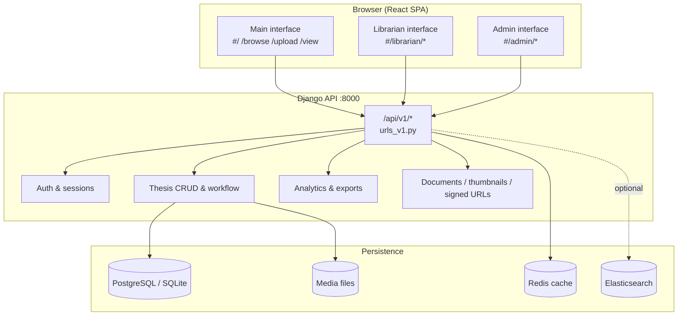
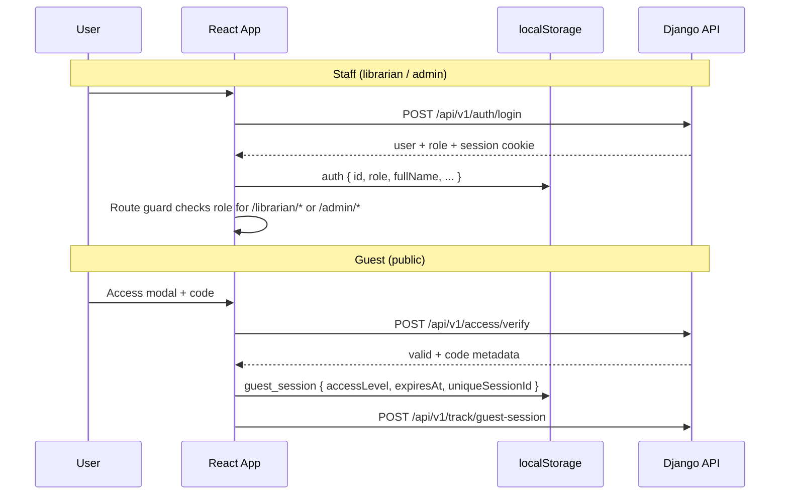
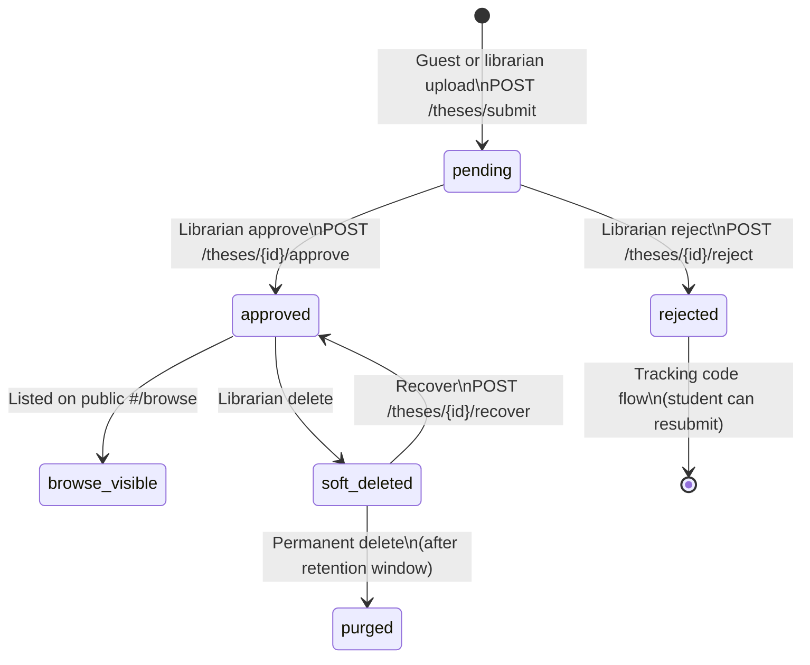

# iThesis

**iThesis** is the digital thesis repository and workflow system for **Batangas State University TheNEU Lipa Campus Library**. It lets students and researchers browse approved theses, submit new work through a controlled access flow, and gives librarians tools to review submissions, manage the repository, issue certifications, and run usage analytics. System administrators manage staff accounts, access codes, and system health.

The stack is a **React + Vite** single-page application (`src/`) talking to a **Django REST API** (`backend/`) over HTTP. Routing is hash-based (`#/…`). The frontend defaults to `http://localhost:5173`; the API defaults to `http://127.0.0.1:8000/api/v1/`.

### Quick read

| What | Where |
|------|--------|
| **Public site** | `#/` browse, `#/upload`, `#/view` — guests use **access codes** (`localStorage`: `guest_session`) |
| **Librarian console** | `#/librarian/*` — review, repository, certifications, analytics (staff login → `auth` in `localStorage`) |
| **Admin console** | `#/admin/*` — staff accounts, logs, system analytics |
| **Routing** | Hash routes in `src/App.tsx` (no React Router) |
| **API** | Django REST at `/api/v1/*` — routes in `backend/ithesis_backend/urls_v1.py` |
| **Core flow** | Upload → `pending` → librarian approve → public browse; reject uses **tracking codes** |
| **Start locally** | Backend: `backend/` → `python manage.py runserver` · Frontend: `npm run dev` |

---

## Table of contents

**Architecture & design**

- [Brief overview](#brief-overview)
- [System architecture](#system-architecture)
- [Repository structure](#repository-structure)
- [User roles and interfaces](#user-roles-and-interfaces)
  - [Main (public)](#1-main-public-interface)
  - [Librarian](#2-librarian-interface)
  - [Admin](#3-admin-interface)
- [Authentication and authorization flow](#authentication-and-authorization-flow)
- [Thesis lifecycle (core workflow)](#thesis-lifecycle-core-workflow)
- [Frontend architecture](#frontend-architecture)
- [Backend architecture](#backend-architecture)
- [File storage and PDF pipeline](#file-storage-and-pdf-pipeline)
- [Optional infrastructure](#optional-infrastructure)
- [How everything flows together (end-to-end)](#how-everything-flows-together-end-to-end)

**Setup & operations**

- [Requirements](#requirements)
- [Quick start (Windows)](#quick-start-windows)
- [Manual setup (all platforms)](#manual-setup-all-platforms)
- [Development commands](#development-commands)
- [Windows launcher scripts](#windows-launcher-scripts)
- [Related documentation](#related-documentation)
- [Troubleshooting](#troubleshooting)
- [License](#license)

---

## Brief overview

| Layer | Technology | Role |
|-------|------------|------|
| **Frontend** | React 18, TypeScript, Vite, Tailwind CSS 4 | Public site, librarian console, admin console |
| **Backend** | Django, Django REST Framework | REST API, auth, file serving, business rules |
| **Database** | PostgreSQL (production) or SQLite (dev) | Theses, users, logs, analytics, access codes |
| **Cache / tasks** | Redis, Celery (optional) | Caching, background jobs |
| **Search** | Elasticsearch 8 (optional) | Full-text search when `ES_ENABLED=true` |
| **Files** | Local disk (+ optional object storage) | PDF manuscripts, executive summaries, thumbnails |

Three **user-facing interfaces** share one codebase and one API:

1. **Main (public)** — landing, thesis browse, guest upload, PDF viewer, about/FAQ  
2. **Librarian** — review queue, repository management, certifications, analytics, access codes  
3. **Admin** — staff management, system analytics, activity/error logs, global access codes  

---

## System architecture



**Request path (typical browse):**

1. User opens `#/browse` → React loads `BrowsePage`.  
2. Guest may enter an **access code** (stored in `localStorage` as `guest_session`).  
3. Page calls `GET /api/v1/theses/browse` with filters (query, department, year, sort, pagination).  
4. Django queries `Thesis` (status `approved`), returns JSON + thumbnail URLs.  
5. User opens a thesis → `#/view` → signed PDF URL → `EnhancedPdfViewer` / `ScrollablePdfViewer`.  
6. View events POST to `/api/v1/theses/{id}/record-view` and guest activity to `/api/v1/track/guest-session`.

---

## Repository structure

```
iThesis-main/
├── src/                          # React frontend (SPA)
│   ├── App.tsx                   # Hash router, auth guards, global chrome
│   ├── main.tsx                  # React root + TanStack Query client
│   ├── index.css                 # Global + interface-specific styles
│   ├── api/                      # Typed API helpers (e.g. theses browse)
│   ├── components/               # Shared UI (grids, session, filters)
│   ├── hooks/                    # React hooks (AI tags, rate limit)
│   ├── pages/
│   │   ├── Main/                 # Public: landing, browse, upload, login
│   │   ├── librarian/            # Librarian console + dashboard components
│   │   ├── admin/                # Admin console + staff management
│   │   └── components/           # Cross-cutting modals, PDF, certificates
│   └── utils/                    # API base URL, auth logout, search, dates
│
├── backend/                      # Django project
│   ├── manage.py
│   ├── ithesis_backend/          # Settings, root URLs, main views, Celery
│   ├── apps/                     # Domain app (models, services, migrations)
│   │   ├── models.py             # Thesis, Department, AccessCode, etc.
│   │   ├── migrations/           # Database schema history
│   │   ├── management/commands/  # CLI: purge, backfill, file audit, ES setup
│   │   └── *.py                  # PDF, email, search, export, middleware
│   ├── templates/emails/         # Transactional email HTML/text
│   ├── tests/                    # API and integration tests
│   └── docs/                     # API documentation
│
├── docs/                         # Project docs, DFD/ERD diagrams, user manual
├── setup/windows/                # Windows one-PC installer scripts
├── scripts/                      # Perf/load scripts, PDF worker copy
├── public/                       # Static assets (logos, banner images)
└── System troubleshoot/          # Batch/shell recovery helpers
```

---

## User roles and interfaces

### 1. Main (public) interface

**Who:** Students, faculty, researchers (guests with access codes).

**Entry:** `#/` (landing), public nav in `App.tsx` (`NavBar`).

| Route | Page | Purpose |
|-------|------|---------|
| `#/` | `LandingPageSwitch` (v1/v2) | Marketing hero, stats, CTA to browse |
| `#/browse` | `BrowsePage` | Search/filter approved theses (virtualized grid) |
| `#/upload` | `UploadThesis` | Submit thesis PDF + metadata (requires upload access code) |
| `#/view` | `DocumentViewer` | Read-only PDF with watermark / security controls |
| `#/about` | `AboutPage` | About iThesis |
| `#/faq` | `FAQPage` | Public FAQs |
| `#/login` | `Login` | Staff login (redirects to librarian/admin) |

**Guest access model:**

- **Browse access** — access code → `guest_session` in `localStorage` (`accessLevel: 'browse'`, 30‑minute TTL).  
- **Upload access** — separate code → `accessLevel: 'upload'` (one code ≈ one submission intent).  
- Session tracked server-side via `POST /api/v1/track/guest-session` → `GuestSessionInfo`.  
- Institutional email (`@g.batstate-u.edu.ph`) and SR code format validated on the client.

**Layout:** Fixed header + optional footer (`LandingChrome`). Librarian/admin routes hide public chrome.

---

### 2. Librarian interface

**Who:** Library staff (`UserProfile.role = 'librarian'`).

**Entry:** `#/login` → `#/librarian` (requires `auth` in `localStorage`).

**Shell:** `LibrarianLayout.tsx` — fixed header (notifications bell), **sidebar navigation** (desktop fixed; mobile drawer), scrollable main content.

| Route | Page | Purpose |
|-------|------|---------|
| `#/librarian` | `Dashboard` | KPIs, action queue, monthly snapshot |
| `#/librarian/review` | `ReviewSubmissions` | Approve/reject pending theses |
| `#/librarian/browse` | `BrowseRepository` | Full repository (incl. pending, edit, delete) |
| `#/librarian/upload` | `UploadThesis` | Librarian-initiated uploads (no student tracking code) |
| `#/librarian/certifications` | `CertificationsForms` | Certificate & form requests |
| `#/librarian/tracking-codes` | `TrackingCodes` | Student submission tracking codes |
| `#/librarian/access-codes` | `AccessCodes` | Generate browse/upload codes for guests |
| `#/librarian/analytics` | `UsageAnalytics` | Usage dashboards & exports |
| `#/librarian/deleted-theses` | `DeletedTheses` | Soft-deleted recovery / purge window |
| `#/librarian/certificate-signatory` | `CertificateSignatorySettings` | Signatory name & signature image |
| `#/librarian/faq` | `FAQ` | Librarian help |
| `#/librarian/view` | `DocumentViewer` | PDF viewer (librarian context) |

---

### 3. Admin interface

**Who:** System administrators (`UserProfile.role = 'admin'`).

**Shell:** `AdminLayout.tsx` — compact sidebar, mobile drawer, 1″ horizontal gutter on desktop.

| Route | Page | Purpose |
|-------|------|---------|
| `#/admin` | `Dashboard` | System overview |
| `#/admin/librarians` | `ManageLibrarians` | CRUD librarian accounts |
| `#/admin/admins` | `ManageAdmins` | CRUD admin accounts |
| `#/admin/analytics` | `SystemAnalytics` | Cross-system metrics |
| `#/admin/logs` | `SystemLogs` | Activity & error logs |
| `#/admin/access-codes` | `AccessCodeManagement` | Global access code oversight |

---

## Authentication and authorization flow



- **Staff auth:** Session/cookie-based Django auth; frontend mirrors role in `localStorage` for route guards. Logout via `utils/authLogout.ts`.  
- **Guest auth:** Short-lived client session + server-side guest tracking; no Django user account.  
- **PDF security:** Signed document URLs, optional security violation logging, watermarks in viewer components.  
- **CSRF:** Frontend prefetches CSRF cookie via `GET /api/v1/version/` on app load.

---

## Thesis lifecycle (core workflow)



**Submission (guest):**

1. Valid upload access code → upload form (`UploadThesis.tsx`).  
2. PDF + executive summary uploaded; metadata extracted (`/theses/extract-fields`, NLP enrich optional).  
3. `POST /api/v1/theses/submit` creates `Thesis` with `status=pending`, assigns **tracking code**.  
4. Email notifications (if configured) via `apps/email_service.py`.

**Review (librarian):**

1. `ReviewSubmissions` lists pending items from dashboard/review APIs.  
2. Librarian opens PDF drawer, may edit details or publication year.  
3. Approve → thesis visible on public browse; reject → student sees status via tracking code page.

**Repository (librarian browse):**

- Superset of public browse: all statuses, edit metadata, soft delete, year-review queue (`publication_year_source=needs_review`).  
- Thumbnails generated on demand (`/theses/{id}/thumbnail`).

**Deleted theses:**

- Soft delete sets `deleted_at`; recovery within retention period.  
- `purge_deleted_theses` management command handles permanent removal after policy window.

---

## Frontend architecture

### Routing

- **Hash router** implemented in `App.tsx` (`useHashRoute`, `pathOnly` from `window.location.hash`).  
- No React Router package — routes are a large `useMemo` switch on `pathOnly`.  
- Heavy pages are **lazy-loaded** (`BrowsePage`, `UploadThesis`, `DocumentViewer`, admin analytics).

### State and data fetching

- **TanStack Query** (`main.tsx`) — browse lists, dashboard data, caching, stale times.  
- **localStorage** — `auth`, `guest_session`, browse page persistence, landing version.  
- **Session UI** — `SessionStatusIndicator`, `IdleTimeoutModal`, guest heartbeat (`utils/guestAccessHeartbeat.ts`).

### Shared components (important)

| Component | Role |
|-----------|------|
| `VirtualizedThesisGrid` | Performant thesis card grid (`@tanstack/react-virtual`) |
| `DepartmentRepositoryFilterList` | Department filter chips (browse pages) |
| `EnhancedPdfViewer` / `ScrollablePdfViewer` | PDF rendering (`react-pdf` / pdf.js) |
| `CertificateGenerator` / `FormGenerator` | Document generation UI |
| `AccessModal` / `UploadAccessModal` | Guest access code entry |

### Styling

- **Tailwind CSS 4** with design tokens in `index.css`.  
- Interface scopes: default public, `.librarian-interface`, `.admin-interface` (card surfaces, density).  
- Responsive behavior uses `lg:` (1024px+) for desktop layouts; mobile/tablet use drawers and bottom sheets.

### API client

- `utils/api.ts` — resolves base URL (`VITE_API_BASE_URL` or `hostname:8000/api` in dev).  
- `utils/enhancedFetch.ts` — credentials, error handling, rate-limit UX.  
- `api/theses.ts` — browse/detail fetch helpers with React Query keys in `utils/queryKeys.ts`.

---

## Backend architecture

### Django project layout

| Module | Responsibility |
|--------|----------------|
| `ithesis_backend/settings.py` | DB, cache, email, ES, media paths, CORS, security |
| `ithesis_backend/urls.py` | Root URL mounting → `/api/v1/` |
| `ithesis_backend/urls_v1.py` | **All v1 REST endpoints** (see below) |
| `ithesis_backend/views.py` | Large view functions for thesis, auth, analytics, admin |
| `apps/models.py` | Domain models |
| `apps/middleware.py` | Monitoring, disconnect handling, security headers |
| `apps/tasks.py` | Celery tasks (when enabled) |
| `apps/thumbnail_service.py` | PDF → thumbnail (Poppler) |
| `apps/pdf_extractor.py` | Metadata / year extraction from PDFs |
| `apps/document_generator.py` | Certificates & forms from templates |
| `apps/search.py` / `search_views.py` | Elasticsearch integration |
| `apps/export_service.py` | CSV/PDF/XLSX report exports |

### Key API groups (`/api/v1/`)

| Prefix / path | Used by |
|---------------|---------|
| `auth/login`, `auth/forgot-password`, `auth/reset-password` | Staff login |
| `access/verify` | Guest access codes |
| `theses/browse`, `theses/{id}`, `theses/submit` | Public & librarian repository |
| `theses/{id}/approve`, `reject`, `document`, `thumbnail` | Review & viewing |
| `theses/track` | Public tracking code lookup |
| `theses/deleted/*` | Deleted theses module |
| `dashboard/*` | Librarian dashboard |
| `analytics/*` | Usage analytics & monthly reports |
| `librarian/access-codes/*` | Access code CRUD |
| `admin/*` | Admin dashboard, staff CRUD, logs |
| `track/guest-session` | Guest analytics |
| `nlp/enrich/*` | AI tag / metadata enrichment |
| `departments` | Department list for filters |
| `system-health/`, `errors/` | Health & error dashboard |
| `docs/`, `schema/` | OpenAPI (drf-spectacular) |

Full route list: `backend/ithesis_backend/urls_v1.py`.  
Examples: `backend/docs/API_USAGE_EXAMPLES.md`, `backend/docs/API_DOCUMENTATION.md`.

### Data model (core entities)

| Model | Purpose |
|-------|---------|
| `Department` | College/program departments for filtering |
| `Author` | Thesis authors (M2M with `Thesis`) |
| `Thesis` | Manuscript record, status, files, counts, soft delete |
| `AccessCode` | One-time or reusable guest codes (browse/upload) |
| `UserProfile` | Extends Django `User` with `role` (admin/librarian) |
| `ActivityLog` | Auditable staff actions |
| `ThesisView` | Per-view analytics |
| `GuestSessionInfo` | Guest session tracking for analytics |
| `CertificateRequest` | Certification workflow |
| `GeneratedDocument` | Stored generated PDFs (certificates, forms) |
| `ThesisReviewLog` | Review history notes |

Entity relationships: see `docs/diagrams/ithesis-erd.mmd`.

---

## File storage and PDF pipeline

1. **Upload** — multipart POST stores files under `MEDIA_ROOT/theses/` and `executive_summaries/`.  
2. **Checksums** — SHA-256 stored on `Thesis` for integrity audits.  
3. **Thumbnails** — generated via Poppler; served at `/theses/{id}/thumbnail`.  
4. **Signed URLs** — time-limited document access (`signed_urls.py`, `get-signed-url` endpoint).  
5. **Publication year** — auto-extracted from PDF (`year_extractor.py`); librarians can fix `needs_review` items.  
6. **Management commands** — `audit_file_paths`, `restore_thesis_files`, `migrate_files_to_object_storage` for ops.

Poppler binaries are bundled under `poppler-25.07.0/` for Windows deployments.

---

## Optional infrastructure

| Service | Env / flag | Purpose |
|---------|------------|---------|
| **PostgreSQL** | `USE_SQLITE=false`, `POSTGRES_*` | Production database |
| **SQLite** | `USE_SQLITE=true` | Quick local dev |
| **Redis** | `REDIS_URL` | Cache, Celery broker |
| **Elasticsearch** | `ES_ENABLED=true` | Full-text search (`apps/search.py`) |
| **Celery** | `ithesis_backend/celery.py` | Async NLP, emails, heavy jobs |
| **Email** | SMTP / Google Workspace | Submission & password reset emails |
| **Prometheus** | `/api/v1/metrics/` | Metrics when `django-prometheus` installed |

For monitoring and deployment details: `docs/monitoring.md`, `docs/deployment.md`, `docs/recovery.md`.

---

## How everything flows together (end-to-end)

### A. Guest browses a thesis

```
Landing (#/) → Access modal → verify code → #/browse
  → GET /theses/browse → VirtualizedThesisGrid
  → click card → #/view → signed PDF URL → record view
```

### B. Student submits a thesis

```
#/upload → upload access code → UploadThesis form
  → extract-fields (optional AI enrich)
  → POST /theses/submit → status=pending + tracking code
  → Librarian notified (dashboard bell / email)
  → Student checks #/browse → Track Thesis Submission (tracking code)
```

### C. Librarian approves

```
#/librarian/review → open drawer → view PDF / executive summary
  → POST /theses/{id}/approve → status=approved
  → Thesis appears on public #/browse
```

### D. Certification request

```
Guest/librarian flow → CertificateRequest created
  → #/librarian/certifications → librarian processes
  → generate-document-from-library → GeneratedDocument
```

### E. Admin maintains system

```
#/admin → manage librarians/admins
  → view SystemLogs / SystemAnalytics
  → optional global access code policies
```

Process diagrams (DFD): `docs/diagrams/ithesis-dfd-context.mmd`, `ithesis-dfd-level1.mmd`, level-2 librarian/admin/user diagrams.

---

## Requirements

| Component | Version / notes |
|-----------|-----------------|
| **Python** | **3.11+** (CI targets 3.11.x) |
| **Node.js** | **20 LTS+** |
| **Database** | **PostgreSQL 16** (full install) or **SQLite** (`USE_SQLITE=true` in `backend/.env`) |
| **OS** | Windows 10/11 (primary); macOS/Linux: manual setup below |

Optional: Redis, Elasticsearch 8, Microsoft Word or LibreOffice (some PDF flows), cloudflared (tunnels in launcher scripts).

---

## Quick start (Windows)

1. Clone the repository.  
2. Open **`setup/windows/`** → run **`SETUP_HERE.bat`** as administrator.  
3. After setup, run **`Create_Admin.bat`** once (see `setup/windows/README.md`).  
4. From repo root, run **`START_HERE.bat`** or **`iThesis_Main.bat`**.

| Service | URL |
|---------|-----|
| Frontend | http://localhost:5173 |
| Backend API | http://127.0.0.1:8000 |
| Django admin | http://127.0.0.1:8000/admin |
| API docs (Swagger) | http://127.0.0.1:8000/api/v1/docs/ |

macOS: use **`START_HERE_macos.sh`** / **`iThesis_Main_macos.sh`**. See **`SETUP_FOR_GROUPMATES.md`** and **`QUICK_START_FOR_GROUPMATES.md`**.

---

## Manual setup (all platforms)

### Backend (`backend/`)

```bash
py -m venv .venv
source .venv/bin/activate          # Windows: .\.venv\Scripts\Activate.ps1
pip install -r requirements.txt
cp .env.example .env               # Windows: copy .env.example .env
python manage.py migrate
python manage.py runserver 0.0.0.0:8000
```

Set `USE_SQLITE=true` in `.env` for SQLite, or configure `POSTGRES_*` for PostgreSQL.

### Frontend (repository root)

```bash
npm install
npm run dev
```

### Typical ports

| Service | Port |
|---------|------|
| Vite | 5173 |
| Django | 8000 |
| PostgreSQL | 5432 |
| Redis | 6379 |
| Elasticsearch | 9200 |

---

## Development commands

**Backend** (with venv active in `backend/`):

```bash
python manage.py migrate
python manage.py makemigrations
python manage.py runserver 0.0.0.0:8000
python manage.py test
```

**Frontend** (repo root):

```bash
npm run dev
npm run build
npm run lint
```

---

## Windows launcher scripts

| File | Purpose |
|------|---------|
| `setup/windows/SETUP_HERE.bat` | Full installer (Python, Node, DB, venv, migrate, npm) |
| `setup/windows/Create_Admin.bat` | Create application admin (`UserProfile.role=admin`) |
| `START_HERE.bat` / `iThesis_Main.bat` | Start Redis (if present), Django, Vite |
| `iThesis_Main_WithGit.bat` | Pull latest git, then start stack |
| `iThesis_Main_macos.sh` | macOS equivalent launcher |

---

## Related documentation

| Document | Contents |
|----------|----------|
| `docs/USER_MANUAL.md` | End-user manual |
| `docs/deployment.md` | Deployment guide |
| `docs/monitoring.md` | Monitoring & Prometheus |
| `docs/recovery.md` | Backup & recovery |
| `docs/diagrams/` | DFD and ERD (Mermaid + draw.io) |
| `backend/docs/API_DOCUMENTATION.md` | API reference |
| `backend/TESTING_GUIDE.md` | Backend testing |
| `backend/EMAIL_SETUP_GUIDE.md` | Email configuration |
| `POSTGRESQL_SETUP.md` | PostgreSQL setup |
| `System troubleshoot/` | Common fix scripts |

---

## Troubleshooting

- **`manage.py` not found** — run commands from `backend/` as `python manage.py …`.  
- **PostgreSQL errors** — check service running and `backend/.env` credentials; confirm `USE_SQLITE` matches intent.  
- **Elasticsearch** — optional; set `ES_ENABLED=false` if no local cluster.  
- **PDF viewer** — ensure Poppler on PATH; see `System troubleshoot/1 - Fix PDF Viewer Won't Load.bat`.  
- **Port in use** — see `System troubleshoot/4 - Fix Port Already In Use Error.bat`.

---

## License

Academic / institutional project — Batangas State University TheNEU Lipa Campus Library. See project maintainers for usage terms.
